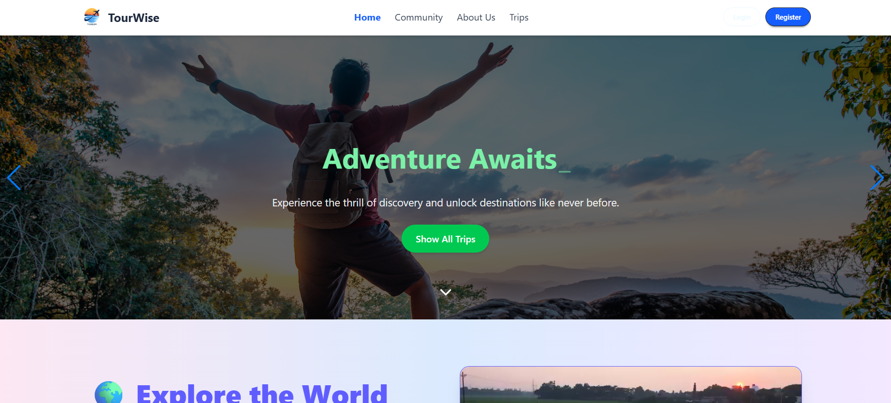

# Tourism Management Website


 
*A user-friendly platform to book tours, select tour guides, and manage tour packages.*

---

## 🚀 Project Overview  
This Tourism Management Website allows users to browse and book tour packages, select their preferred tour guides, and apply to become tour guides themselves. Admins have full control to manage users, candidates, and packages. Secure payments are integrated using Stripe.  
The frontend is built with React.js, and the backend uses Node.js and Express.js.

---

## 🌐 Live Demo  
[View Live Project](https://tourism-management-7390d.web.app/)  

---

## 🛠️ Technologies Used  
- **Frontend:** React.js, Tailwind CSS  
- **Backend:** Node.js, Express.js  
- **Database:** MongoDB  
- **Payment Integration:** Stripe API  
- **Tools:** Git, VS Code, REST APIs  

---

## ✨ Features  
- User registration, login, and profile management  
- Browse and book tour packages  
- Select preferred tour guide for each booking  
- Apply to become a tour guide  
- Admin dashboard to manage users, candidates, and packages  
- Secure payment processing with Stripe  
- Responsive and intuitive UI  

---

## ⚙️ Dependencies  
- react 18.x  
- react-router-dom  
- axios  
- express 4.x  
- mongoose 6.x  
- stripe  
- dotenv  
- cors  

---

## 🏗️ Getting Started (Run Locally)  

### Prerequisites  
- Node.js (v14 or later)  
- MongoDB (local or cloud instance)  

### Installation Steps  

1. **Clone the frontend repo:**  
   ```bash
   git clone https://github.com/alamindev07/tourism-management-client.git
   cd tourism-management-client

---

*Built with ❤️ by Md Al-amin Mia*

